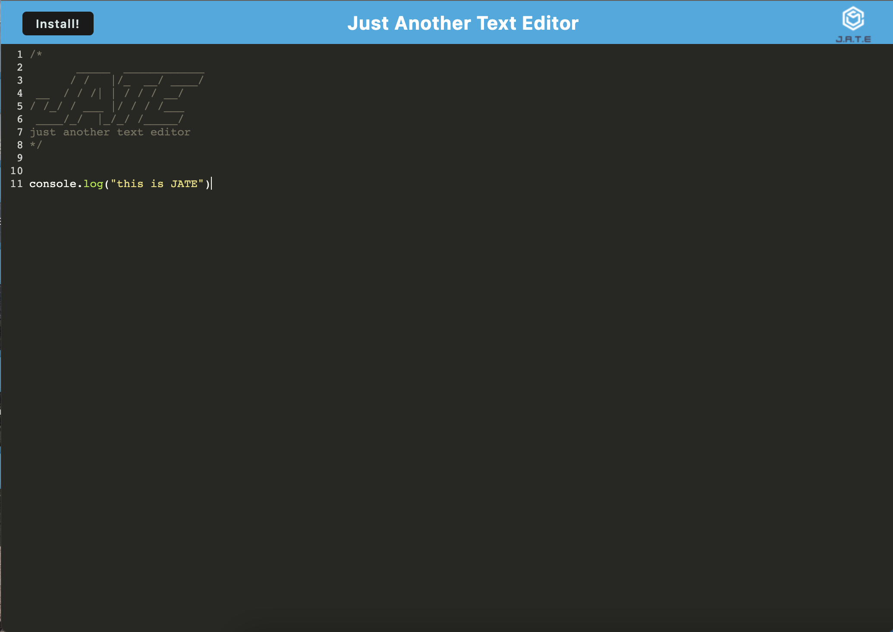

# text-editor-pwa

## Description

This is project is a progressive web application with text-editor functionality. When navigating to the hosted website, users can input text that is saved and retrieved using indexDB. Additionally, users can use this application offline and download it like a native application.

## Installation

No installation steps are required to use this application as it is hosted through Heroku. To access the application and begin using, just navigate to: 

https://powerful-hollows-83769.herokuapp.com/

If you would like to install the application onto your computer for easy access, simply press the "install me" button in the top left corner, then open the application like you would any other native app.

## Usage

To use this application, begin typing onto the screen. Any edits you make will be stored to indexDB or local storage, so there is no need to manually save your text.

## Credits

workbox documentation: https://developer.chrome.com/docs/workbox/

deploying to heroku: https://coding-boot-camp.github.io/full-stack/heroku/heroku-deployment-guide

## License

MIT license
